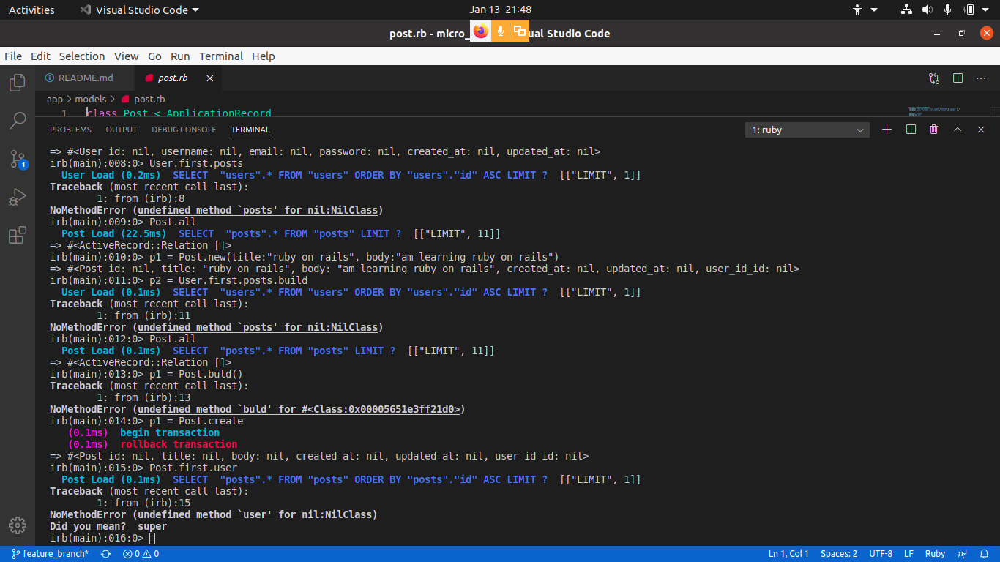

# README

# Micro Reddit

## Table of contents

- [About](#about)
- [Features](#features)
- [Built with](#built-with)
- [Getting started](#getting-started)
  * [Prerequisites](#prerequisites)
  * [Installation instructions](#installation-instructions)
- [Authors](#authors)
- [Contributing](#-contributing)
- [Show your support](#show-your-support)
- [Acknowledgements](#acknowledgments)
- [License](#-license)

---

## About

This is a simple Micro Reddit clone where user can create a post and comment on other posts.

## Features

The features of this project are listed as below:

- Create User
- Create posts as a user
- Add comments to posts

## Built With

- Ruby
- Rails

## Getting Started

### Prerequisites

If you intend to download the project, you will need to have Ruby already installed on your machine. For more information on how to install Ruby, follow [this link.](https://www.ruby-lang.org/en/downloads/)

### Installation instructions

Follow along the steps below to get a copy at your local machine.

- Navigate to the directory where you want this project to live and then clone it `git clone git@github.com:uchennaanya/micro_reddit.git`
- Navigate to the `micro-reddit` directory
- install the gem package with `bundle install`
- Migrate the database on your local machine `rails db:migrate`
- Open the console ($ rails console)

**To get your own copy of our project clone the repository to your local machine.**

[repository](https://github.com/uchennaanya/micro_reddit)

# Run bundle install

# Run rails s

## Authors

👤 **Tshepo Molefe**

- Github: [@tshepo](https://github.com/TSHEPO-CLOUD)
- Twitter: [@tshepo](https://twitter.com/tshepomolefe)
- Linkedin: [TSHEPO MOLEFE](https://linkedin.com/tshepo-molefe)

👤 **Uchenna Anya**

- Github: [@uchennaanya](https://github.com/uchennaanya)
- Twitter:[@matinsanya19](https://twitter.com/matinsanya19)
- Linkedin: [Uchenna Martin Anya](https://linkedin.com/Uchenna-Anya)

## 🤝 Contributing

Contributions, issues and feature requests are welcome!

Feel free to check the [issues page](https://github.com/uchennaanya/micro_reddit/issues).

## Show your support

Give a ⭐️ if you like this project!

## 📝 License

This README would normally document whatever steps are necessary to get the
application up and running.
This README would normally document whatever steps are necessary to get the
application up and running.

Things you may want to cover:

* Ruby version

* System dependencies

* Configuration

* Database creation

* Database initialization

* How to run the test suite

* Services (job queues, cache servers, search engines, etc.)

* Deployment instructions

* ...
